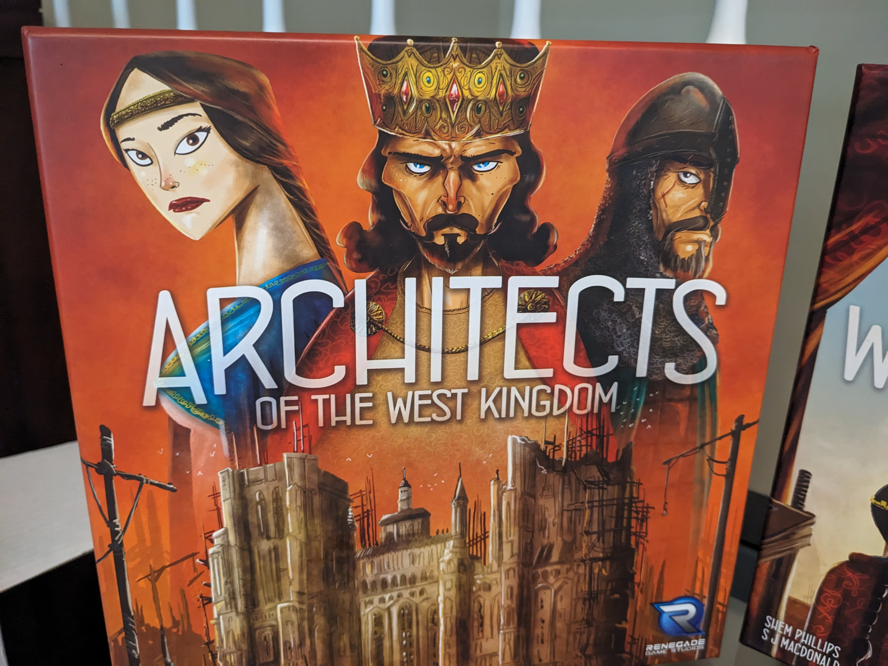
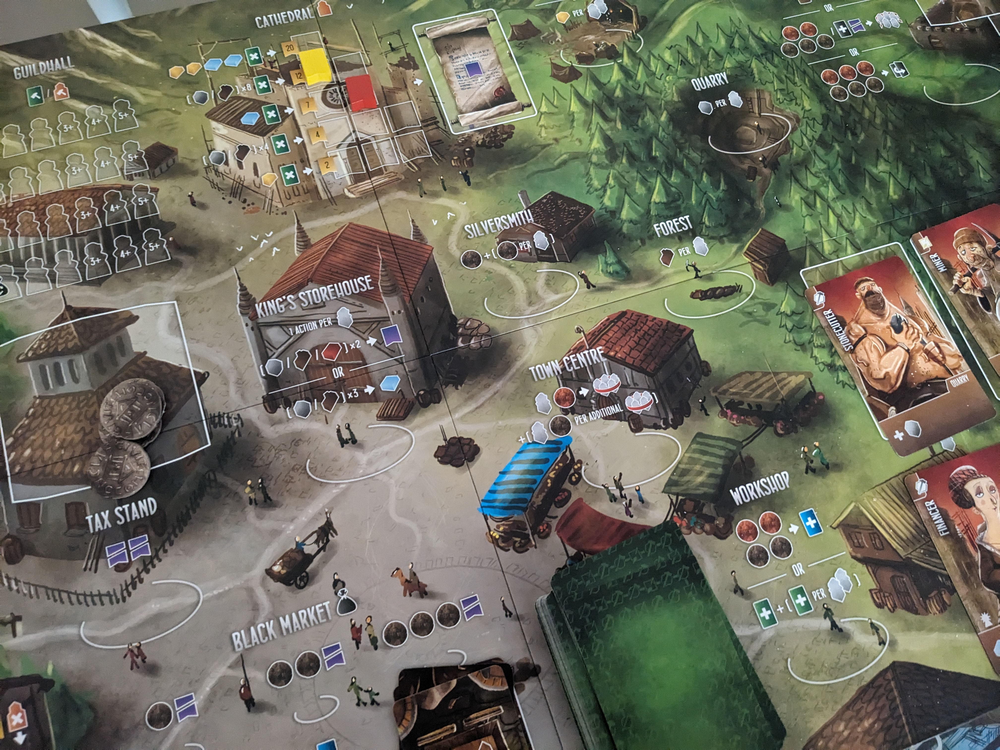
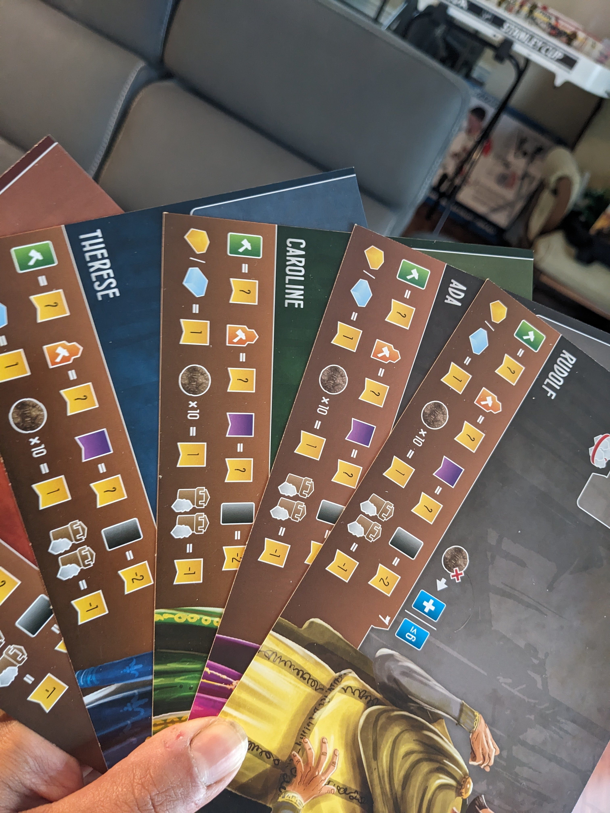
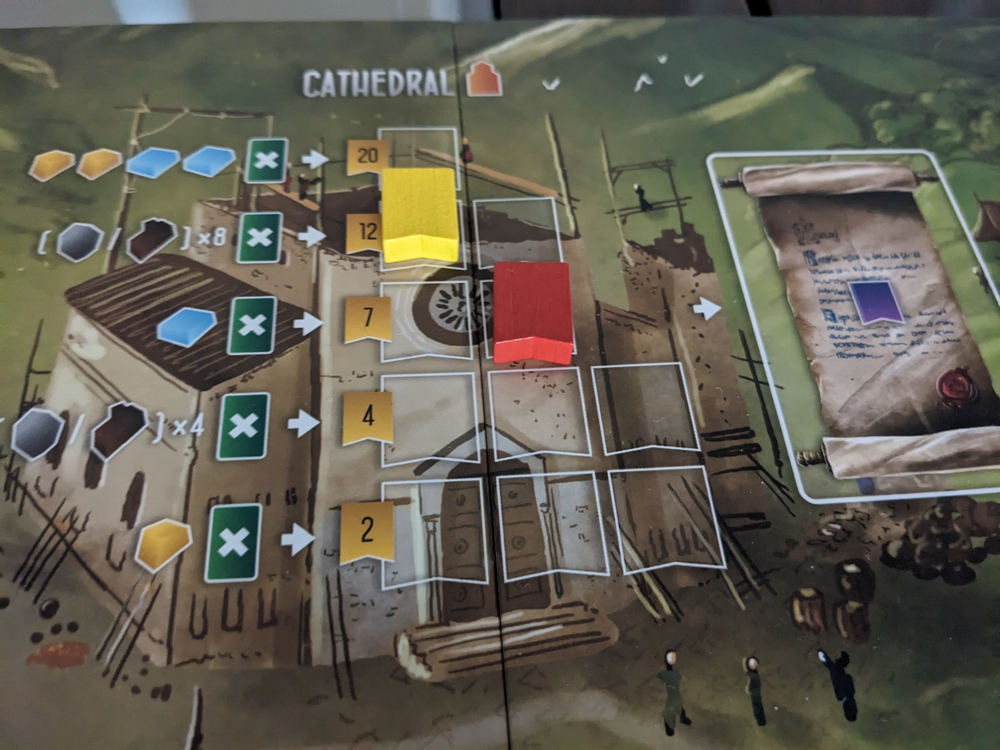

Architects of the West Kingdom is a competitive game for 1 to 5 players, designed by Shem Phillips and SJ Macdonald. Set at the end of the Carolingian Empire circa 850 AD, as royal architects compete to impress their king and maintain their noble status by constructing various landmarks and the cathedral.

The stunning medieval town design immediately captured my interest. I’m particularly drawn to games with a civilization theme or those that offer a realistic human touch. The board contains a prison, tax stand, black market, open areas for resources (mines, forests) with small community centers like a Town Center or King's Store.

## General Concepts of the Game

Architects of the West Kingdom is a worker placement game that’s easy to learn and allows for swift actions each turn. However, each action can involve a variety of decisions. Do I collect resources? Should I capture my opponent’s workers? Do I become cruel and steal money from the tax stand? Do I go after the black market?

Civilians or apprentices exist in the game which are needed to be hired for their skills that allows you to construct any of the buildings. These apprentices bring specific skills that provide various benefits and resources throughout the game.

Before the game begins, you have a choice between five architects with certain resources to begin with. On top of that you have 20 worker tokens which eventually you’ll send them off to work within the town and hopefully impress the king by building that cathedral.

Tension rises as you observe some of your opponent’s workers congregating and working in the forest or mines. Typically, the workers become greedy, prompting you to send one of your own workers to the town center, pay a tax, and prevent those opposing workers from collecting excessive resources.

Eventually you will run out of workers which you need to bring back to your play board except for workers that were placed in the Guildhall. Buildings have an end game point value and sometimes an in-game benefit. Each worker in the Guildhall that is placed  brings the game closer to its end.

At game end, you’ll receive points for the Buildings you’ve built, your level on the cathedral, your space on the Virtue track, each Gold or Marble resource is worth a point, and each 10 Silver is worth a point. You’ll lose points for unpaid Debt cards and every two workers in prison.

## My General Experience

I really like the quickness in turns for this game but at the sametime you need to watch for situations that can happen on the board. There’s so many decisions to make for one action. Sometimes so much urgency, needing to collect resources, to quickly build the buildings or race up the cathedral. Feels rewarding when you place your workers in the same location multiple times gaining more resources. When your workers are captured, the fustration comes in and needed to restart your workers again.

I'm always mindful of my virtue track, as it can significantly impact your gameplay. The virtue track represents the moral and ethical progression of your character. If it drops too low, you won't be able to contribute to the cathedral and will accumulate debts. If it rises too high, you won't be able to use the black market, but you'll eventually pay off your debt cards.

The player interaction in the game is enjoyable and tense as you can ruin other players' strategy plans by capturing their workers and eventually sending them to prison. For each worker you send to prison you collect a coin. Of course, that money is used to hiring apprentices.

Don't forget about your workers in prison. If a black market reset happens, debts are handed out to whoever has the most workers.

The more workers you send to the Guildhall, the fewer you have on your player board. Eventually, you'll run out of workers and will need to bring them back to your board.

## Final Thoughts

Overall, I really enjoy playing this game and have logged many plays. There's always a lot happening in the town, and even though the mechanics are straightforward, the game offers plenty of deep strategic decisions.

The game doesn't end there! You can enhance the gameplay experience with two expansions: The Age of Artisans and Works of Wonder. These expansions add more content, depth and complexity to the game. I'll be writing blogs about each expansion soon with some strategy tips.
