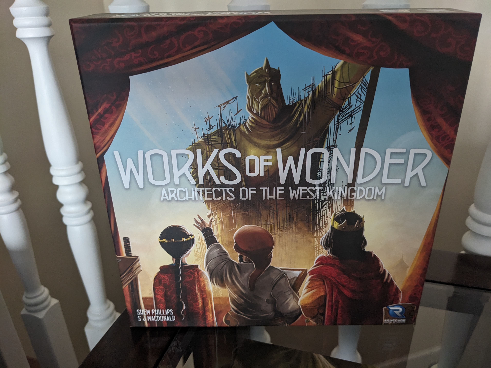
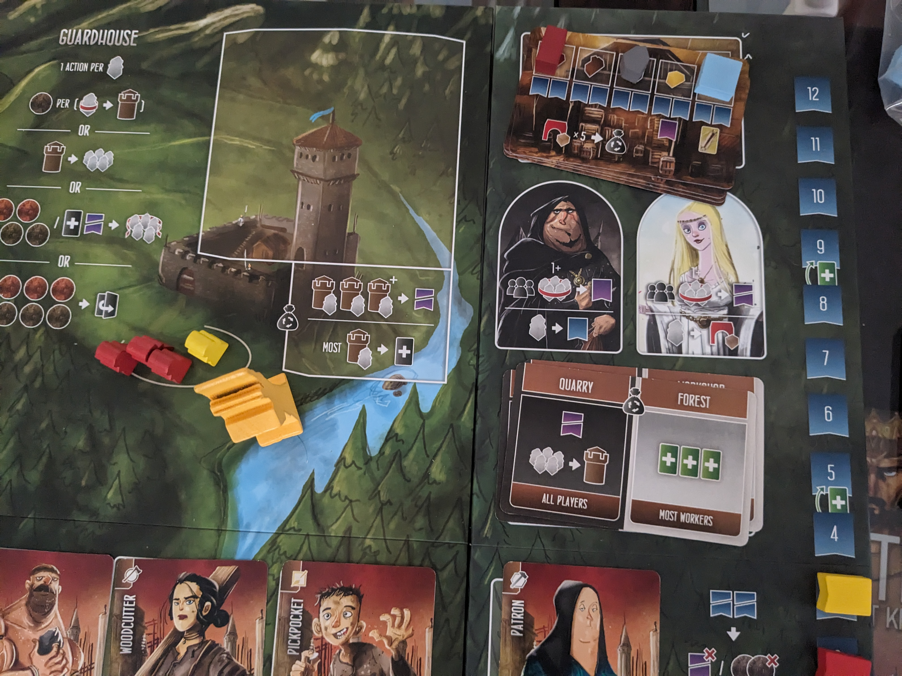
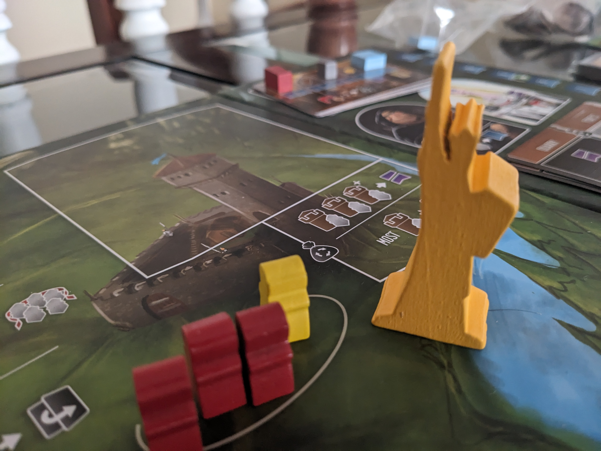
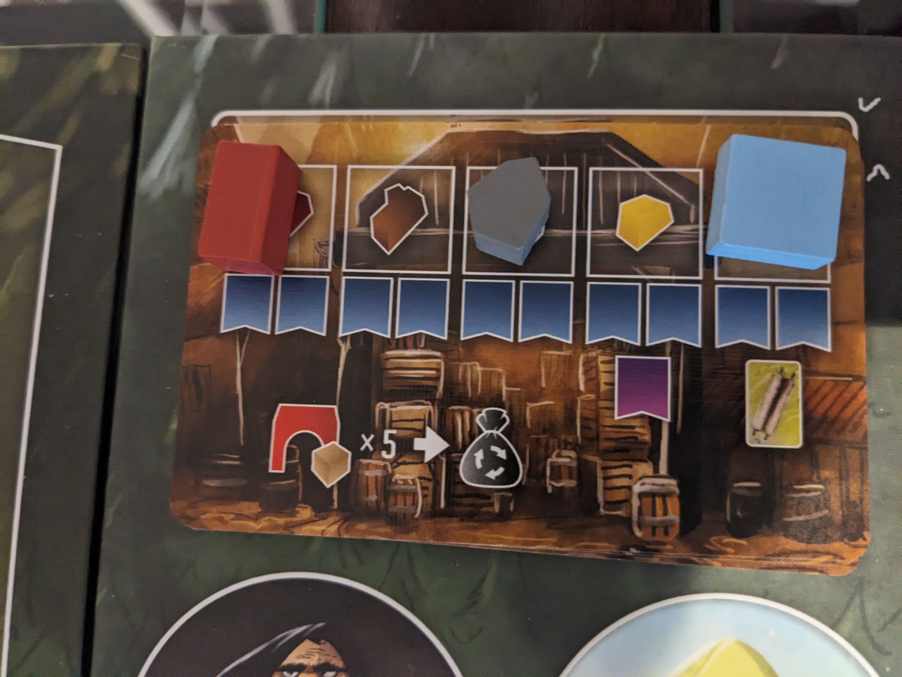
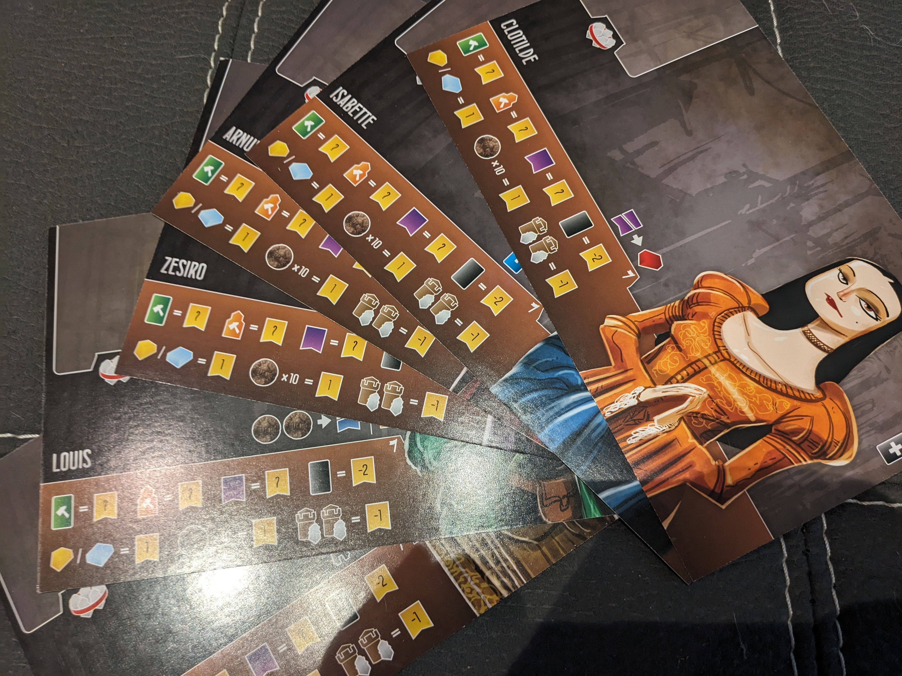
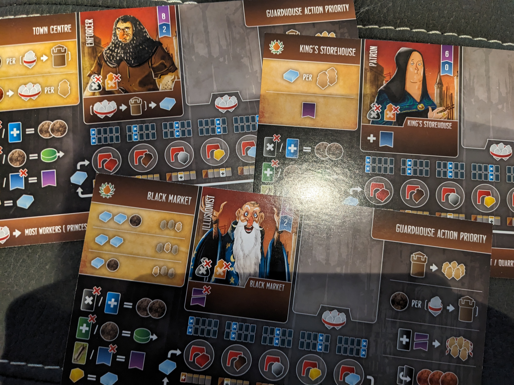
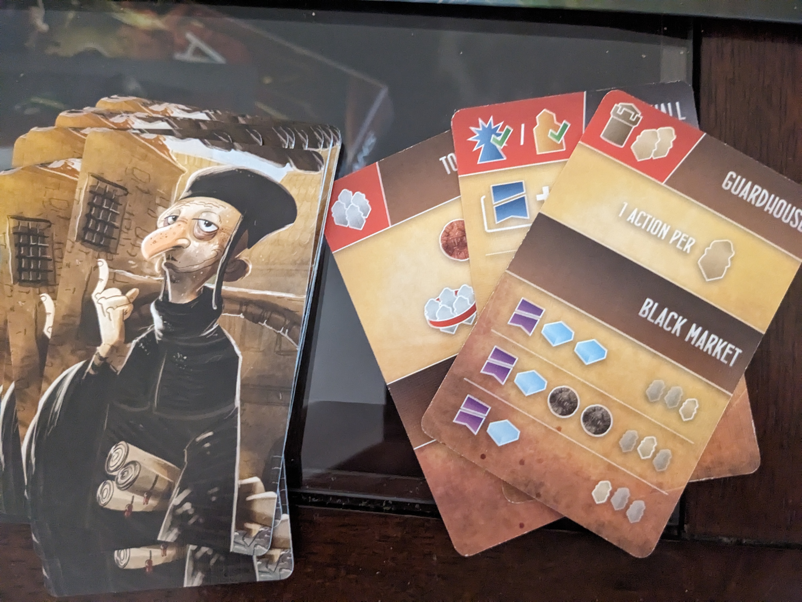

[Buy Works of Wonder](https://ca.nobleknight.com/P/2147971464/Architects-of-the-West-Kingdom---Works-of-Wonder?awid=1445)

Contains affiliate link which supports the blog MeepleIt financially.

The king has declared a desire for new monuments to enhance the town's beauty. With the cathedral already constructed, five new wonders are needed to expand the town. Only architects with high reputations will be granted this prestigious honor and continue to impress the king.

Works of Wonder, the second expansion for the Architects of the West Kingdom. This expansion introduces more components, mechanics and enhances the base game by adding depth, more strategic options, and additional paths to victory. We'll dive into the new mechanics, features, and how they enhance the base game, helping you decide if it's a must-have for your collection.

## Theme & Story

The town has evolved and now requires more buildings, as the king has requested the construction of five new wonders. The architects must work harder not only to gather more resources but also to enhance their reputation, in order to earn the king's favor.

They will collaborate with the Princess by contributing resources and demonstrating their dedication through increased influence. However, there is also the Profiteer, who is ruthless and does not want the architects to succeed. While the Profiteer will grant you influence whenever you visit, you will eventually face a cost for it.

As the architects construct their wonders, they will earn status in specific locations by impressing the king!

## New Mechanics

The expansion introduces the new influence track board which matches and aligns perfectly next to the main board. The track increases the architect's reputation that goes towards in building one of the five wonders.

For the architects to built these wonders, they need to accompany the Princess. When placing a worker on the Princess's location, they immediality contribute a resource with addition of their influence increasing. Similar to the Virtue track.
The Princess is clearly a kind-hearted character, but if you do something mischievous, like capturing workers in her location, she'll penalize you on the virtue track.

The Profiteer that represents someone who takes advantage of situations for personal gain, often at the expense of others. He provides you an influence when placing a worker on his location. If you capture workers at his location, he'll reward you with a virtue for your mischievous actions. Sounds great! However, when the black market resets according to the Consequence card, you'll need to pay for it. So, be cautious about associating with the Profiteer.

## Beautify the Town

Now your thinking, how do we build these wonders?

Collecting resources is still essential due to the increased need for influence and coins. The amount of resources needed has grown, with some wonders requiring up to 15 resources which are indicated in the top left corner of the cards.

What's the benefit?

Once you have built a wonder, you can place it on any location. Onced placed, you can either double the worker's value or gain influence.

A viable strategy involves prioritizing resource gathering early in the game with the goal of constructing a wonder. Once completed, strategically place your next structure to maximize resource production in that area. This approach can create a powerful engine, efficiently generating essential resources.

If you're fortunate and the Profiteer is on the same location as your structure, you'll also gain influence at the same time. But be careful you will have consequences if you have too many worker with the Profiteer.

## Black Market Reset

In addition to the primary black market reset, a secondary reset is triggered when all resource spaces are occupied. Essentially, the Princess and Profiteer have maximized their influence in these areas and must reposition according to the consequence card.

## New Architects Additions

The expansion introduces six new architects that are tailored to fit the updated influence track. Although you can still use characters from the base game, the adjustments are minor. To fully experience the new influence track, it's recommended to play with the new player boards.

## Solo Play

The solo mode's six different boards are amazing! Each opponent is a formidable foe with their own style, handling everything from building wonders to using special worker abilities.

Also new set of solo AI cards are included, replacing the exisitng base game, making AI more challenging and resembles playing against a human opponent. Each card presents a condition that must be fulfilled; if it isn't, the next step is carried out. The AI adapts its strategy according to the current board state, ensuring that each game feels unique.

In one game I played, the AI managed to constructed one wonder. Initially, I was concerned that they would aggressively pursue wonders, but that wasn't the case. They also don't capture your workers or gather marble resources as easily as they do in the base game.

Once you get used to the AI cards, you'll start to anticipate their actions. Play smartly to counter their moves when they happen—don't hesitate to capture their workers and go after the tax money!

## Pros

There's so much more to appreciate about this game. As a medium to heavy gamer, I value the complexity and added strategic depth it offers. The way the AI functions is particularly impressive—without it, I wouldn't enjoy playing the base game solo.

- **Increased Depth**: New mechanics and wonders, enriching the game’s strategic depth and variety.
- **Replayability**: With new architects and wonders, each game can offer a different experience, increasing replay value.
- **Enhanced Replayability**: With new architects and wonders, each game can offer a different experience.
- **AI Module**: Upgraded AI boards provide a more authentic human opponent experience.

## Cons

The are a few issues

- **Complexity Increase**: The expansion might add complexity to the game, which could be overwhelming for players who prefer a simpler experience.
- **Learning Curve**: The new influence track may require a learning curve with some extra rules to remember.
- **Solo mode**: If you’re not a solo player, the additional content may not be worth the cost.

## Final Thoughts

Architects of the West Kingdom is a solid starting point, but Works of Wonders elevates the game to a whole new level. With the expansion, the game now rivals the acclaimed Paladins of the West Kingdom, and some even argue it surpasses it.

Initially, I found the base game to be somewhat shallow, with an AI that lacked challenge. I was on the verge of removing it from my collection until the expansion breathed new life into the game. It's an absolute must-have for series enthusiasts.

If you own Architects of the West Kingdom, Works of Wonders is an essential addition that significantly enhances gameplay and replayability.

Happy Gaming!

### Buy The Game

[Buy Works of Wonder](https://ca.nobleknight.com/P/2147971464/Architects-of-the-West-Kingdom---Works-of-Wonder?awid=1445)

Contains affiliate link which supports the blog MeepleIt financially.
