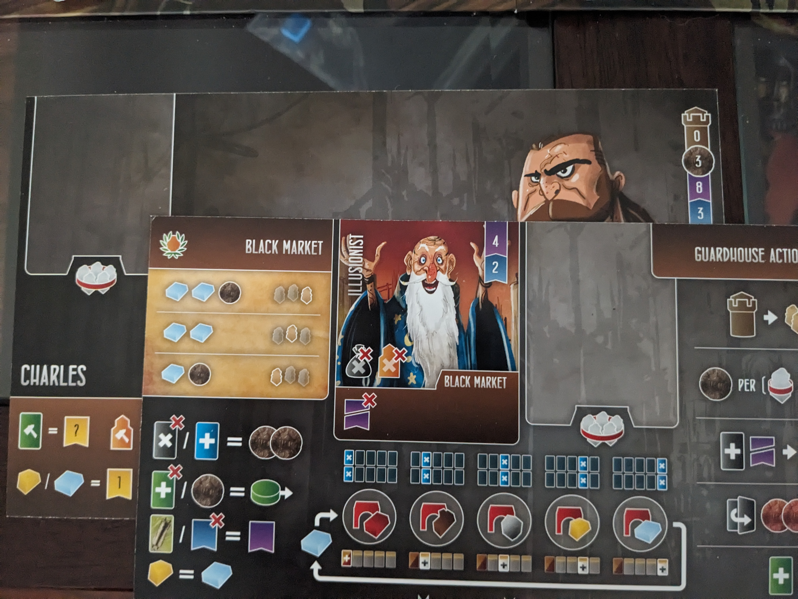
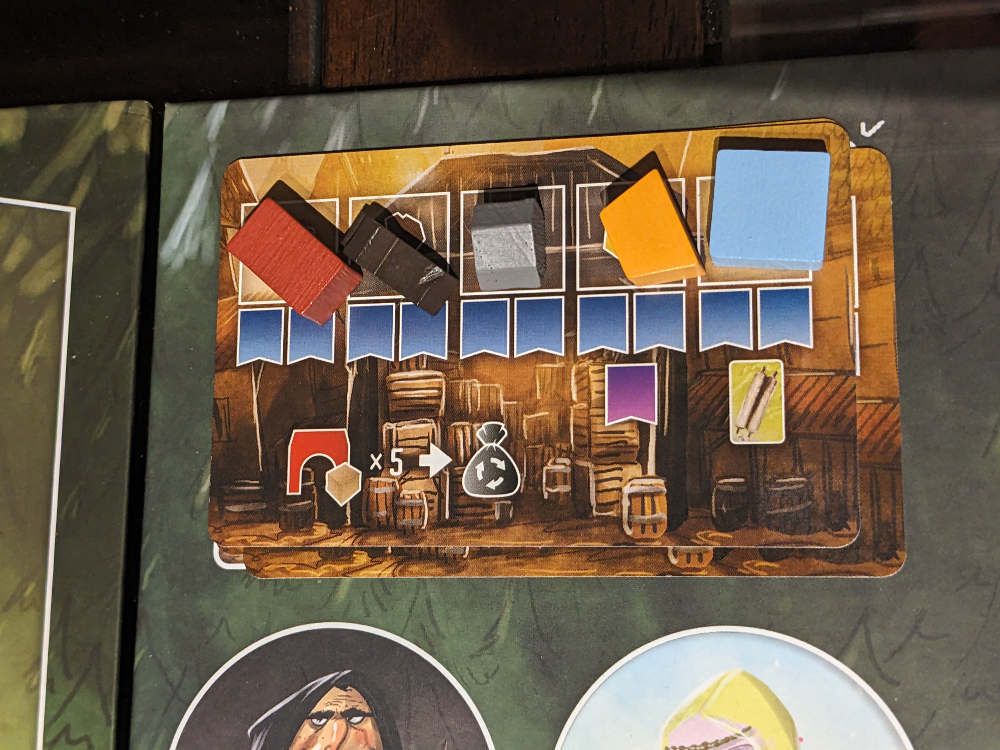
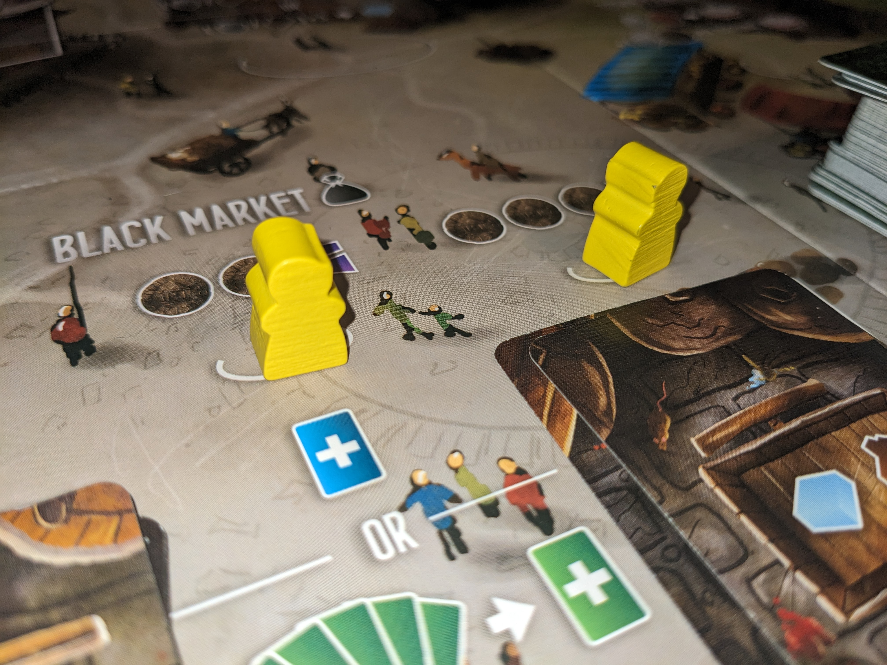
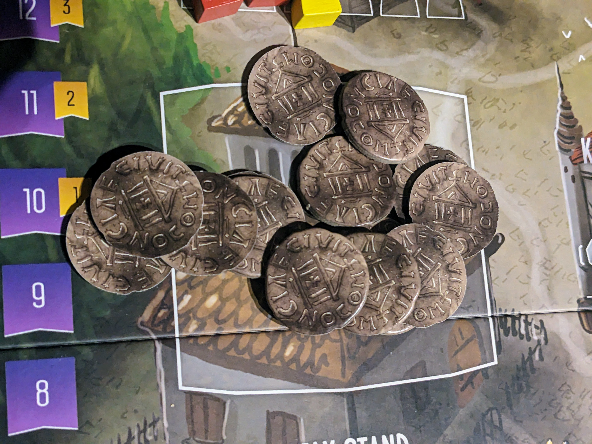

[Buy Works of Wonder](https://ca.nobleknight.com/P/2147971464/Architects-of-the-West-Kingdom---Works-of-Wonder?awid=1445)

The king has given his command, and as we prepare to construct the wonders to impress him, Charles is gearing up to confront the Illusionist(bot).

I'll be reviewing the gameplay and highlight some strategies. I usually play on the variable side, where my architect, Charles, starts with two wooden resources. My plan was to get an early advantage with the wooden Wonder. Additionally, I needed to address Charles' influence, which started at the base level of two.

## Lets Build Those Wonders

I started by placing my workers in the forest to collect wood, and contributing resources with the Princess which is a valuable way to progress on the influence track. These resources stay unused until a black market reset happens, at which point they are transferred to their respective Wonder cards. If you choose to contribute your resources, ensure you eventually trigger a black market reset by completing the resource markers on the contribution cards, visiting the black market, or placing a worker in the Guildhall.

Constructing the wooden wonder was a challenge as I had to manage the AI's overzealous workers while simultaneously building my influence. Once completed, I strategically placed it on the mine location to target either the gold or mines wonder. Unfortunately, the AI claimed the Gold Wonder, forcing me to pivot my strategy and focus on acquiring the fifteen mine resources for the Mine Wonder.

Another note, prompt a black market reset, especially if the bot has prisoners and workers at the Profiteer's location. This will impose negative effects on them, such as debts and a loss of virtue.

The tax stand was overflowing with Silver coins, which I raided several times for a decent profit. However, my virtue level fluctuated between six and eight. While maintaining a high virtue score is beneficial for resource and money accumulation, it shouldn't be the sole focus. I neglected the black market, missing out on potentially valuable resources due to concerns about my virtue level. I've come to understand that incorporating visits to the black market into my strategy is necessary. Sometimes, embracing a bit of evil is essential to gain a quick advantage.

Naturally, the AI sends their workers to multiple locations, such as the King's Storehouse, which helps them increase their virtue. For some reason, their virtue level soared quickly. I consistently monitored their workers and made an effort to capture them.

Lost in the competitive rush to finish the Cathedral (which I didn't) and secure workers on the Guildhall before the game ended, I overlooked resource collection for the Mine Wonder. Despite eventually building the Mine, the bot outpaced me by constructing the Clay and Marble Wonder structures.

I enjoyed pursuing the game's wonders after the initial excitement wore off, but the resources and time required to build them were considerable, much like in reality. I seldom hire apprentices, only bringing on just enough to construct the buildings I want. As a result, I ended up building only one building.

## The King Was Impressed

The final result was 48 - 43 for the Illusionist which impressed the king. Illusionist grabbed 3 of the 5 wonders and accumulated abundance of marble with seven points from the virtue track. It was a tight decision for the king as I did play some defensive strategies to avoid the AI to accumulate extra points but lost focus collecting resources.

On my end, I managed to secure just 2 wonders and 1 building. I also finished a few levels up on the Cathedral, earning 7 points. I overlooked that Charles gains one Silver each time he places a worker at the Profiteer's location. Even though I had 33 silver coins left to spend, I deliberately avoided the Profiteer because he imprisons your workers if you have the most workers at his spot.

Overall, the game was quite challenging, with numerous decisions and a tendency to spread focus across too many areas. The new Wonders add an interesting mechanism, though they’re not crucial for victory. Concentrating on buildings and the Cathedral are still essential, but acquiring a Wonder and generating resources more quickly can also provide a significant boost.
