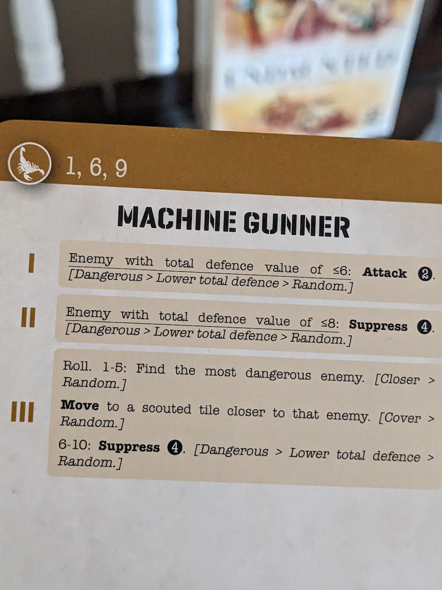
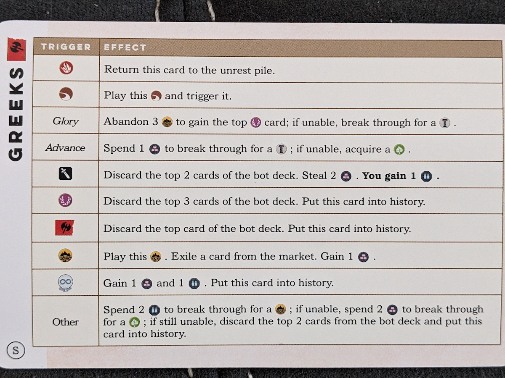
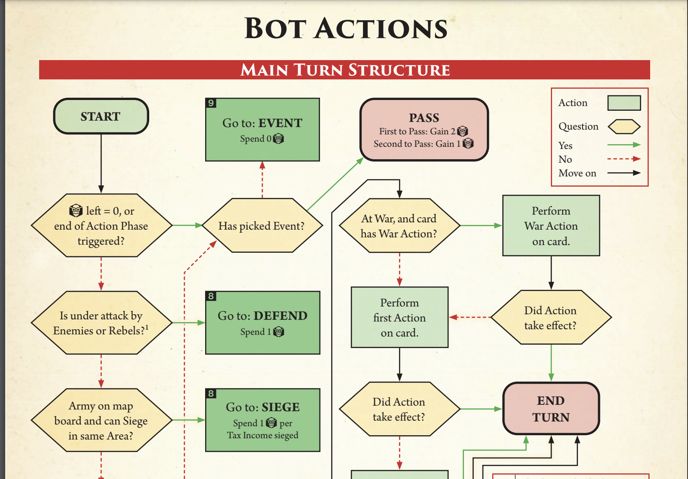

Solo play has always been my primary criterion when purchasing a game. I rarely considered the designer of the game, as I was more focused on the mechanics and theme. In this blog, I’ll explore how and why David has become one of my favorite designers for solo gaming.

David Turczi, a prominent board game designer, has become a significant influence on me over the past year. Every time I hear his name mentioned in connection with a board game, I can't help but get curious and immediately check it out. He is well-known and respected for releasing several highly-rated and frequently played games throughout his career. Specializing in solo modes, he is renowned for his intricate Eurogames. Here is a list of some of his notable games:

- 2016 Days of Ire: Budapest 1956
- 2017 Anachrony
- 2017 Kitchen Rush
- 2018 Dice Settlers
- 2019 Nights of Fire: Battle for Budapest
- 2020 Tekhenu: Obelisk of the Sun
- 2020 Tawantinsuyu: The Inca Empire
- 2020 Rome & Roll
- 2020 Rush M.D.
- 2021 Imperium: Classics
- 2021 Imperium: Legends
- 2021 Excavation Earth
- 2021 Venice
- 2021 The Defence of Procyon III
- 2021 Vengeance: Roll & Fight Episode 1 & 2
- 2022 Perseverance: Castaway Chronicles - Episodes 1 & 2
- 2023 Voidfall
- 2023 Nucleum
- 2024 Imperium: Horizons
- 2024 Star Trek: Captain's Chair
- Terraforrming Mars: Automa

## Discovering David Turczi

Began with Anachrony and Fractures of Time. I bought the game and explored its various solo modes. I was amazed by how well it played solo, almost as if it were designed for human interaction. Compared to other solo games I’ve played, such as Lost Ruins of Arnak, Endless Winter, and Tapestry, this one ranked exceptionally high for me in terms of solo play.

Eventually, Voidfall and Nucluem started generating buzz on BoardGameGeek. I didn't initially pay attention to the designer of these games, but when I finally looked them up, I was stunned to see David's name associated with them. I’m not sure why I was drawn to all these games without realizing David was the designer.

Eventually, my interest also expanded to deck-building games. Imperium Legends/Classics caught my attention due to the release of Imperium Horizons. Again, I didn’t realize it was David Turczi behind these games until I started researching. I immediately felt compelled to buy Legends to experience the solo mode. I was amazed by how the AI bot performed in Imperium Legends, and that’s when I fell in love with the game and David as a designer.

## Mechanics in David's Solo Games

David's solo modes may be quite complex for some players. To understand and carry out the AI bot's actions, you need to follow specific conditions depending on the game's circumstances. If these conditions yield a true or false result, the AI will act similarly to a human. Essentially, the AI bot adjusts to the game's scenarios, making it challenging for users and hard to anticipate its next move.

For instance, here's a solo bot card for the Machine Gunner from Undaunted Reinforcements for North Africa game. It outlines three steps to follow. If you're familiar with the game, you'll grasp this quickly. When a condition is met, you execute the action; if not, you proceed to the next step, and continue in this manner.

Some additional rules are incorporated to mimic human behavior. For example, when the bot discards a Fog card, it draws a card from its deck and places it face down for the next round, where as a human player would simply add it to their hand and play it.

Example from Imperium Classics

Similar as the Undaunted North Africa, the bot typically plays a card based on the symbol icon, and then follows the logical steps outlined in the rules. Depending on the situation of the bot, for example resources or cards the bot has, they will perform that action. Then on to the next card and perform the same steps. Each civilization has its own unique bot card detailing these conditions. Playing against different civilizations will offer various strategies.

This might seem quite daunting, as the learning curve can be steep and mentally exhausting for some players. I occasionally take breaks myself, but I still appreciate the complexity as it enhances the strategic depth and replayability of the game. The AI adapts to various situations, making each playthrough unique.

Think of it this way: in a video game, when playing against the CPU, the AI follows a series of logical steps. Similar concept, but adapted to board games in a more streamlined form. I really appreciate how this approach is applied to board games, making the solo mode more interesting and engaging.

Europa Universalis: The Price of Power features an extremely complex bot AI, developed by David. This serves as a prime example of how the game, inspired by a video game, incorporates a lot of intricate logic to manage its gameplay.

David's involvement in the solo mode wasn't from the very beginning, but he contributed significantly to developing a robust AI, making the solo experience both complex and engaging. This game pushes the boundaries of what a board game can achieve and might not appeal to everyone. However, by learning and following the logical steps, it can deliver an epic experience. It also offers a glimpse into how David infuses complexity into his solo game designs.

## My Collection of Games by David Turczi

Most of the games in my collection are from David. Here’s a list of the ones I currently enjoy along with some I’m considering buying in the future.

- Europa Universalis - The Price of Power
- Undaunted Reinforcements - Normandy & North Africa
- Imperium Horizons/Legends/Classics
- Anachrony
- Terraforming Mars Automa (Waiting for retail release in Oct 2024)
- Voidfall (Wishlist)
- Nucleum (Wishlist)

I am sure there are likely other excellent solo game designers out there, but for some reason, David really excels at creating increasingly better solo modes with each game he releases. His ability to create immersive experiences that challenge players while providing replayability is truly impressive. Whether it's through unique gameplay mechanics or well-crafted narratives, David consistently delivers memorable and enjoyable gaming experiences.

## Closing Thoughts

I’m incredibly grateful and pleased that David is releasing so much solo mode content, as it keeps me deeply engaged in the hobby. Without these solo modes, I’m not sure how often I’d get to play games. Before discovering David, I've often wondered how long I would continue to enjoy solo games, as some haven't lived up to my expectations or didn't justify staying in my collection.

If you're passionate about solo gaming, I highly recommend checking out David's work. His solo modes are designed with meticulous attention to detail, ensuring they offer a challenging and immersive experience. Whether you’re looking for intricate strategies, dynamic gameplay, or a deep solo experience, his designs are likely to keep you excited and engaged. His games often push the boundaries of solo play, providing a sense of accomplishment and enjoyment that can rival or even surpass playing with other people. If solo gaming is your focus, exploring his designs could greatly enhance your gaming collection and experience.
