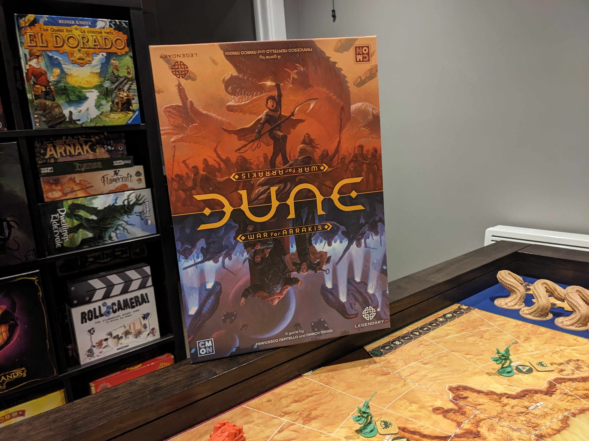

I got chance to play Dune: War of Arrakis. This is not a copy of mine, but a good old friend of mine that bought it. He has been inviting me a few times to play which I appreaciate. It gives me the opportunity to explore and experience other games. Currently right now we are the only two dudes that know how to play within our group but I'm sure eventually other people will know.

I wanted to play the Atredies as I was in the mood of hanging out in the desert and try to accomplish some of their secretive objectives. I wasn't in the mood in attacking enemies which I find the Harrkoenes are a larger army to handle. The Harkkoeens strategy is to come out of their settlements and attack my seitches.

So I began working on my objectives accomplishing some of them at the sametime waitng for the Harkkoenes to come out of their settlements and attack me. Few battles began which I was able to win and killed some of the units. I wanted to reduce the units and hopefully go in the settlements and grab the tokens that help you advance on the track quickly.

In the desert I wasn't destroying much of the harvesters as I want to maintain my desert actions. I got sand worms appearing on the board and completeing more of the secret objectives.

Half way through the game, I was having a hard time with the objectives. I couldn't accomplish them as I ran out of actions trying to protect my setiches. I started to bcome abit lost and began losing focus on my main strategy. More of the Harkkoenes where attacking me which was turing into an intensive game. I continued to battle and reducings their units. I felt stuck in the out skirts of the desert and the only way I though was to go in and invade some of the settlements so I can advance on my track.

The invasion grew towards the Harkkonens as I was blocking them from the seitches. More of my secitches were being left alone in th desert as I beegan invading the settlements and battles. My oppenent felt choked up as If I had him in a head lock.

Then he pulled out a planned action card. "Move 3 units anywhere in the desert!" In the meantime as he was reading it, I was planning on my next move. Next think I see 3 units adjecent to each of my 3 EMPTY scietches! Where in the hell did that card come from? I took a peek on each tokeen to see how much he would advance and which one I can protect. I had only one deployment and able to protect one of the three sietches.

Fast forward,  he did his attack action and completed the game. One lesson I learned was don't leave your sietches alone. Of course the smart way of doing it was leave one or two units behind. But I went full force instead which The Artiedies are not meant to play this was way. Just focusing on the secret objectives is the way to go for the Atredies.

It was still an intensive game as we battled back and forth
