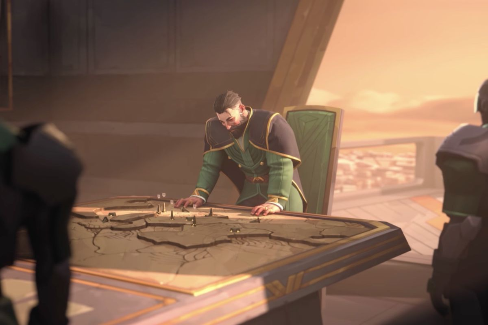
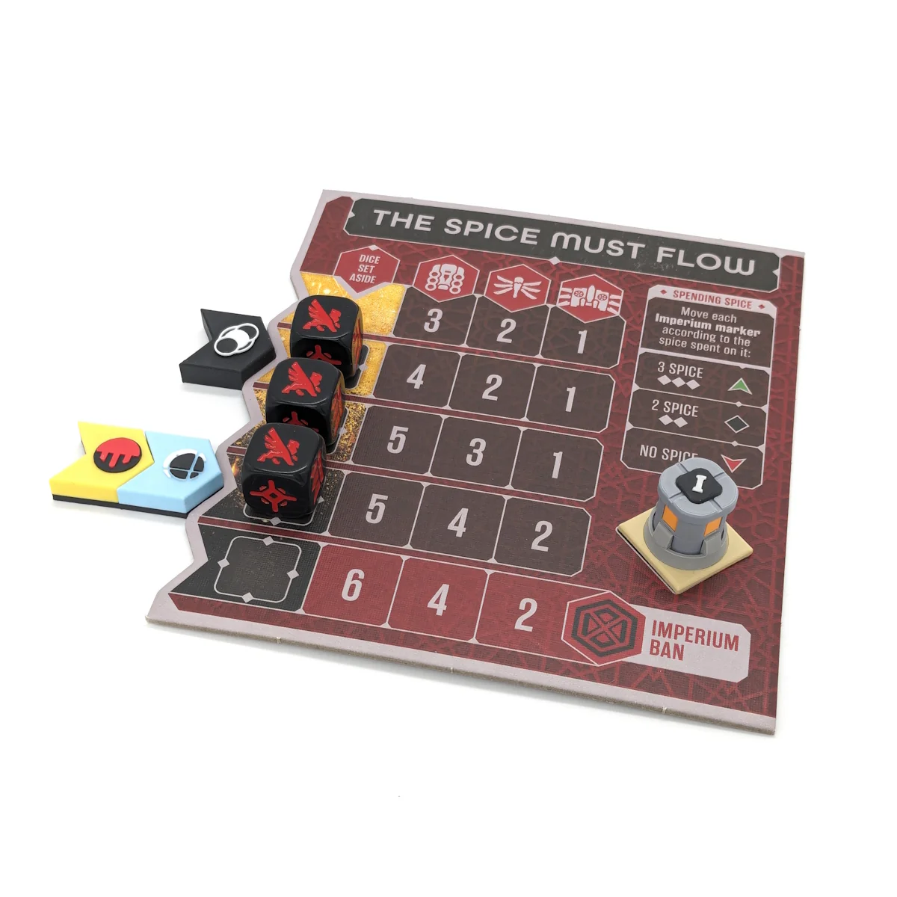

In one of my previous blogs, I discussed how "Dune: War for Arrakis" captures the thematic elements of the Dune universe. In this article, we’ll delve deeper into one of the game's most critical aspects: Spices. I'll evaluate how effectively this mechanic plays out with the two factions, with my own strategic experiences. Primarily intended for those who have played the game or have a familiarity with the Dune universe.

### Spices Overview

In the Dune universe, the conflict is primarily between the Atreides and Harkonnen.The Harkonnens have control of Arrakis as they are the only source of the spice melange. The Atreides, attacking after the Harkonnens, wanting to take control of these spices. Basically, whomever controls Arrakis controls the spice. And who controls the spice controls the universe.

Spices provide several benefits and play a central role in the universe's economy and politics. Here are the key aspects:

- **Extended Life**: Spice consumption significantly extends the lifespan of those who use it regularly. This property makes it highly valuable to the elite and powerful individuals across the universe​.

- **Enhanced Mental Abilities**: Spice enhances cognitive functions and grants prescient abilities.

- **Space Travel**: The most critical function of spice is its use by the Spacing Guild's navigators. By ingesting large quantities of spice, these navigators gain the ability to fold space, allowing for interstellar travel.

- **Economic and Political Power**: Control over spice production and distribution is a significant source of economic power. The faction that controls Arrakis, the only source of spice, wields considerable influence over the entire universe.

### Mechanics in Game

The Harkonnens manages an extra board called “The spice must flow.” This board contains 5 levels or rows and each level demonstrates how many harvesters, ornithopter, carryall can place at the start of the round. Obviously the harvesters are the important components that will collect the spices. The carryall also protects the harvesters from the sandworms.

There are 3 imperium markers representing the interests of CHOAM, Spacing Guild, and Landsraad. These will eventually level up or down and ban certain abilities if not enough spices were gathered. Also a dice will be placed on the square which will decrease an action for the Harkonnens for the next round.

### How it plays

At the start, the Harkonnens will start with eight dice actions and while the Atreides will begin with four with additonal four desert actions. Every dice action that the Harkonnens performs, the Atreides will also decrease in desert actions. When reaching the same amount of actions or less then Atreides' desert actions are disabled. The Harkonnens must constantly gather spices to maintain their level, while the Atreides disrupt the harvesters. Units can be moved to protect the harvesters, but there's always a risk of losing them in the desert.

Three harvesters will be placed in the desert, which will generate spices based on certain areas of the desert.
This will help to maintain each Imperium marker on the same level twos spices are needed.

If, at the end of the round, any harvesters have not survived, each Imperium marker will drop a level. For example, if four spices are collected, two markers stay at the same level, and one drops a level, resulting in the loss of a benefit card.

### Strategies with the Harkonnens

By lowering the Harkonnens' level on the "The Spice Must Flow" board, the Atreides' desert actions are reduced. This also enables the Harkonnens to deploy more harvesters in the desert, boosting their chances of collecting spices.

Playing as the Harkonnens, I didn't mind leveling down, as it posed a challenge for my opponent. His desert actions were reduced, and despite being limited to six actions (down to the 3rd row), I still managed to win some battles and increase my supremacy track.

I had to be cautious not to level down too much, as receiving 3 Imperium marker ban cards would reduce some of my benefits. This is a challenge you need to manage. Having many harvesters in the desert helped me maintain the level.

### Strategies with the Atreides

I had the opportunity to play as the Atreides. Overall, I discovered that the Atreides had a significant advantage in controlling the spices. Instead of disrupting the harvesters, I let them be, as they gathered spices to maintain their level. This strategy enabled my Atreides to maintain their desert actions, making it difficult for the Harkonnens to attack my sietches, as I had sandworms placed throughout the desert.

### Conclusion

Most of the rules and details are not covered, but this provides an overview of how spices are played in the game. The spice mechanism adds an interesting balance, allowing the Atreides to increase or decrease their actions based on spice levels. This introduces a significant strategic element, making the game both challenging and intense for both sides.
