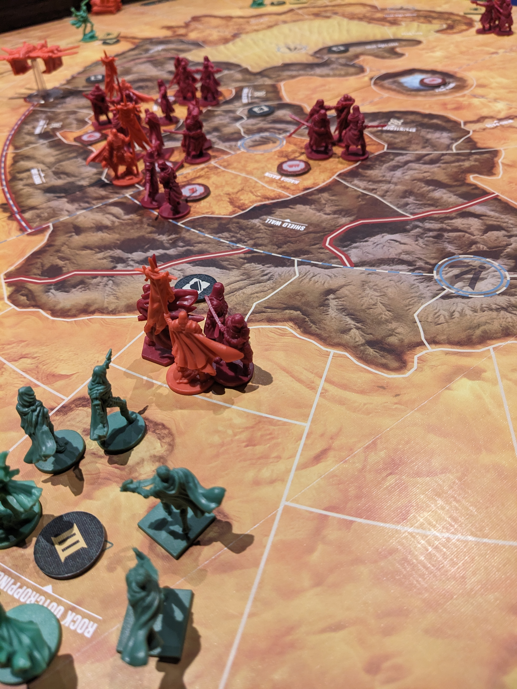

I recently had the chance to dive into the world of "Dune: War for Arrakis," an epic head-to-head game that stands out from the Dune Imperium series by focusing more on combat and area control.

While I haven’t explored the Dune Imperium series and my experience with Dune movies is limited, this game is a treat for fans of the franchise. The game’s thematic design is robust and incorporates intriguing mechanics. Initially, I was unfamiliar with how these elements tied into the Dune universe, but the connections became clearer as I played.

### Mechanics Involving the Factions

One of my favourite aspects of the game is the asymmetric faction mechanics. The Harkonnens and Atreides are the central factions, each with distinct strategies and challenges.

- Harkonnens: need to venture to the outskirts to extract spice. If they fail to do so adequately, they suffer penalties and lose dice. Additionally, they aim to destroy the Fremen sietches. Their base in the center is surrounded by impassable mountain ranges, but the Harkonnens can use Ornithopters to bypass these obstacles and other hazardous areas in the desert. The Harkonnens start off with eight dices which allows them to have 8 actions within a round

- Atreides: are allied with the Fremen, and although their resources are limited, the Fremen's deep knowledge of the desert is invaluable. They can ride sandworms to travel vast distances, direct worms to attack Harkonnen troops, and disrupt the spice flow. The  Atreides start off with 4 dice but can deploy sand worm tokens only if they’re dice actions are less than Harkonnens.

### How does the thematic play enhance the gameplay?

If you’re into games that contain a strong theme, being a Dune fan you're in heaven!
One part that stood out for me, was having my units or legions out in the open outskirts in the desert.  Eventually sand worms and sand storms will occur and destroy anything on its path. I was devastated and immediately realised how horrible I played my strategy!  My approach was to attack the Atreides deep into the desert but left them stranded.

Collecting species with the Harkonnen is another aspect of the game(probably the most important as in the movie) that initially had no clue at first. Spice enhances perception, allowing navigators to travel safely. Perfect description taken from the ‘CMON’ site

> The most important world in the Imperium is Arrakis,  due to being a vast planet-size desert. Here is where one finds spice, a substance required for interplanetary travel. Whomever controls Arrakis controls the spice. And who controls the spice controls the universe.

> Dune: War for Arrakis puts players in the role of the heads of Houses Harkonnen and Atreides during the events of the Desert War. They each have their own goals and resources to ensure that, in the end, control of the spice is theirs.

In the game, you deploy vehicle harvesters to collect spices. If your vehicles survive until the end of the round (and aren't destroyed by san worms), you'll earn spices to help maintain the resource levels. If they’re destroyed, you’ll lose a dice action and will need 3 species to level up again. Species are crucial, and keeping your vehicle harvesters alive each round is a challenge. You can protect them using the Carryalls.

One strategy that worked well for me was allowing my spice level to decrease. Although I lost some actions, my opponent had fewer desert actions, limiting their powers. Additionally, this gave me the opportunity to deploy more vehicles. At the same time make sure you gain some Geissken tokens. These tokens offer players the flexibility to perform any action of their choice, basically like a wildcard token replacing the action dice that was lost due to the spice level.

### Watch out For Those Sand Worms

The miniatures in the game are well-designed and significantly enhance the thematic experience on the board. There are an abundance of units, including elites and leaders, with all the leaders being actual characters from the actual Dune film. However, be cautious of the sandworms. They not only perfectly capture the theme but also add an extra challenge for the harvesters, reducing the spice resource collection for the Harkonnens.

Other than miniatures, the board is beautifully designed to represent the harsh, expansive desert environment of Arrakis, complete with sand dunes, rocky outcroppings, and key locations from the Dune universe. The artwork and design elements of the board capture the aesthetic, with intricate details and thematic color schemes that enhance the overall atmosphere. Overall, the main board successfully integrates thematic elements to create an engaging and authentic representation of the Dune universe.

### Should You Buy?

"Dune: War for Arrakis" offers an immersive and strategic experience that captures the essence of the Dune universe. With its thematic elements, unique faction mechanics, and engaging gameplay, it appeals to both dedicated Dune fans and newcomers alike. Whether you're managing resources, navigating the desert, or engaging in tactical combat, the game provides a rich and varied experience that brings the world of Arrakis to life.

Best of all, you only need one additional player to enjoy this game, as it’s designed for head-to-head play. The game's high replayability ensures months of enjoyable gameplay. So, gather a friend, prepare for battle, and immerse yourself in the epic struggle for control of the spice. The desert planet awaits your command.

[Buy Dune: War of Arrakis](https://hobbiesville.com/products/dune-war-for-arrakis-standard-edition?ref=okgqqcpm)
