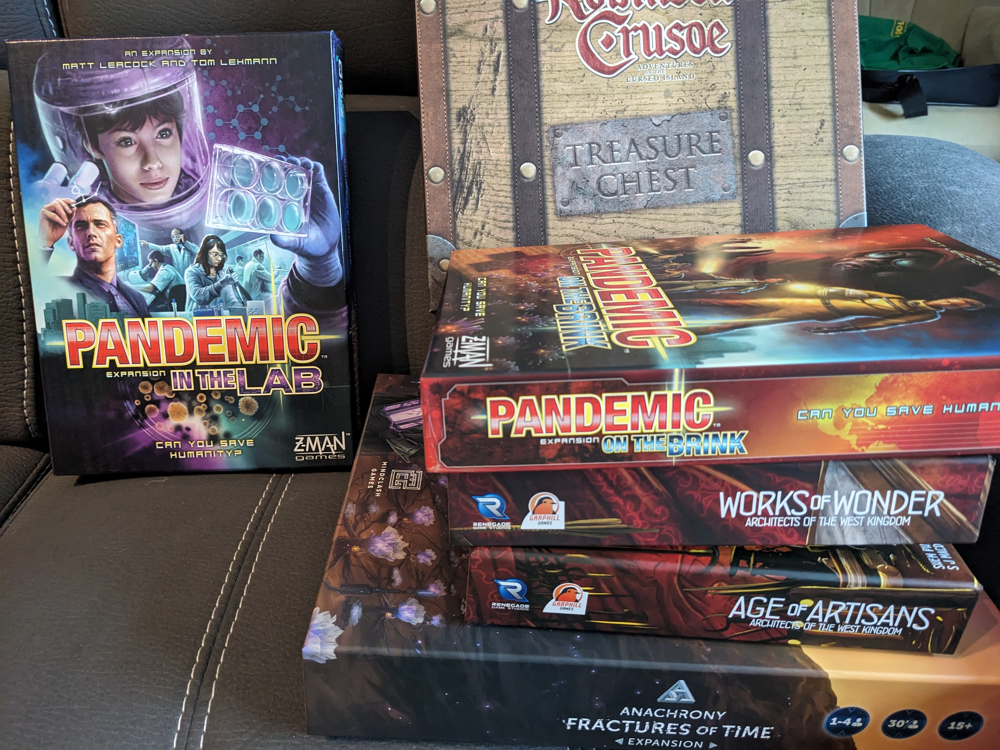

Rather than analyzing individual board games, we'll take a step back to examine the overall process of building a collection and choosing games to play. After all, you can't pick a game if you don't own any.

I've been in the board gaming hobby for nearly two years, and while my collection is still growing, I currently own eleven games, with most all of them including expansions, with the exceptions of Terraforming Mars and Europa Universalis. Yes! I still have to learn and play Europa Universalis!

## Started in 2023

I only started back in Jan of 2023. By the time you discover this article, situations could have changed. As of now (August 2024), I am still fresh in the hobby. My knowledge of board games is extensive, and even with a relatively small collection, I can still discuss board games in general, as I've played many other games with my gaming group.

## Financial Priorities

Wouldn't it be nice if money grew on trees, especially for board game enthusiasts? But let’s be honest—we all have other priorities in our lives.

With prices on the rise, especially when comparing to the United States, game prices here in Quebec, Canada, are noticeably higher.

## Selective with Board Games

First few months when I got into the hobby, I was buying games often and exploring. Sometimes I didn't even know what I was buying. My wife and kids questioned about this and didn’t understand.

Fast forward today, it’s great I explored and know what games I want in my collection. I’m not interested in buying a game that has the same mechanics but a different theme. For example, if I have Wingspan why have Wyrmspan? Gloomheaven why Frostheaven? At one point, I was interested in Halls of Hegra which is a solo war game, surviving the German attacks. Since having Robinson Crusoe do I need another survival game? It’s still in my want to buy list, but right now not really interested.

## Solo Player

I am a big solo gamers. Purchasing a game needs to contain a strong solo mode. I always come across several interesting games, but if they lack solo, it's off my list. While many games offer solo modes, not all of them resonate with me. For example, after about 15 plays, with Lost Ruins of Arnak, it no longer clicked for me, and since I didn't have others to play with, I decided to traded it for Mage Knight.

The solo mode in Terraforming Mars isn't particularly strong. It helped me learn the game, but eventually, it started to feel stale. However, with a new Automa solo mode expansion on the horizon, I'm keeping it in my collection and plan to give it more plays. So why look for another game when this one has new potential?

## Recycle and Replay Games

I enjoy replaying my games frequently. More experienced and knowledgeable, I choose board games that offer substantial content and high replayability. When I'm eager to add a new game to my collection, I review my existing games to determine which one can be let go. I only keep games that I can't stop thinking about, knowing I'll eventually want to play again. I don't have a "shelf of shame" filled with unplayed games. If I want to keep them all, well I will squeeze it in. :)

 It's a mystery to me how people maintain extensive board game collections while still getting regular playtime. If I hadn't been diligent about selling or gifting games, I'd probably have a huge collection with many untouched titles.

## Enjoy the Expansions

Other than buying new games, I lean towards investing in expansions. Not sure if that can be considered an extra game in your collection or grouping them together as one game. If counting them separately then I would have grown to 20 games.

Expansions are another way of replaying games or bringing them back to life. Some truly fantastic expansions can significantly enhance various game elements. For example ‘Architects of the West Kingdom’. The AI became stale and not challenging. I did some research and decided to purchase Works of Wonder, which totally enhanced my playing solo experience and stayed in my collection.

## Conclusion

I hope this gives you some ideas on how to manage your own collection or if you're curious about mine. One guideline I’ve heard is that for every game that comes in, another has to go out. Some hobbyists refer to this as the 'not more than (x number)' rule.

One important point is to focus on enjoying the games you have. Having a larger collection doesn't necessarily make someone a better hobbyist; it might even lead to confusion.

Personally, when I discover a game I really want, I dive deep into watching videos and reading about it. This often makes me more knowledgeable about the game, even before I own it, rather than just letting it sit in my shelf of shame.

Happy Gaming!
