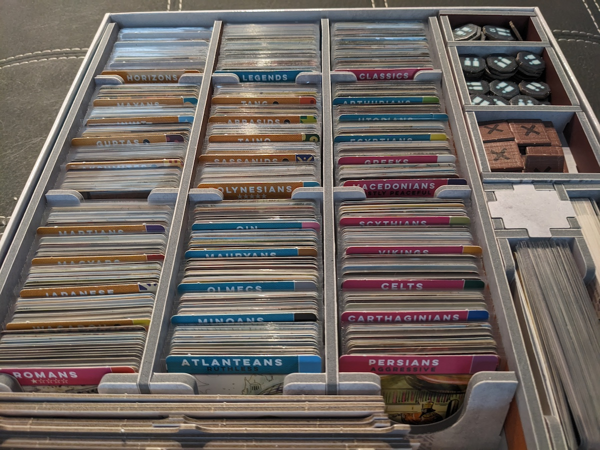

Over the past few months, I've realized that relying heavily on BoardGameGeek ratings and rankings can sometimes be misleading. It might lead you to purchasing games that don't suit your tastes or miss out on hidden gems. Whenever I browse the top 100 games on BoardGameGeek, I find myself questioning the rankings: How do certain games end up ranked higher than others? Is Brass: Birmingham really deserving of the #1 spot? And why is Lost Ruins of Arnak ranked at 28 while Anachrony lingers at 49 which I enjoy Anachrony much more.

I’ve noticed that are certain comments or rating being based on these factors in BGG ratings which can impact a game's score or give it an undeserved negative impression. Don’t get me wrong, I value the community’s feedback, but here are the three specific factors that, in my opinion, shouldn’t influence a game’s rating.

- Length of a game
- Setup time
- Complexity

I strongly believe these three factors should be highlighted and mentioned for newcomers exploring a game, as it can help prevent disappointment once they have the game in hand or from leaving the hobby out of frustration. However, these factors shouldn’t give the game a negative reputation or make it difficult for the community to embrace it. This is why I tend to overlook these types of factors and have ultimately help me discover more enjoyable games.

## BoardGameGeek's Rating System

First, let’s touch on the rating system in BGG. Without diving into the specifics or algorithms. Here’s a quick overview: as we all know, users rate games and often write brief review. The overall rating of a game will increase or decrease depending on the number of ratings it receives.

BGG takes certain factors into account, such as the number of ratings a game has received. For instance, if a new game is released and gets 10 comments & ratings, all at 9.5, does that mean it will automatically reach the top? Typically, new games start with a default lower rating because the system is designed to prevent a few high ratings from quickly boosting a game's ranking to the top.

Might be off the topic, but check out this video for a good explaination of the BGG rating system:
<iframe width="560" height="315" src="https://www.youtube.com/embed/UqFvEzhjSfI?si=WvgP82DzZmtaDnWa" title="YouTube video player" frameborder="0" allow="accelerometer; autoplay; clipboard-write; encrypted-media; gyroscope; picture-in-picture; web-share" referrerpolicy="strict-origin-when-cross-origin" allowfullscreen></iframe>

Lets get into the 3 main points.

## Length of Gameplay

I frequently come across this perspective and have seen games rated according to these criteria, but I completely disagree with it. Here's why I believe lengthy games add significant value to a collection:

Longer games often have the advantage of developing richer narratives, backstories, and thematic elements, resulting in a more immersive experience. Players have the opportunity to delve deeper into the game’s universe, forming stronger connections with characters, settings, and storylines. Additionally, the extended duration of these games can make victories feel more rewarding, as they typically require sustained effort, strategic planning, and adaptability.

Lengthy games also foster prolonged interaction among players, leading to more meaningful conversations, alliances, and rivalries. The length of the game contributes to a memorable shared experience, something players can reminisce about long after the game has ended. If a game excels in these areas, it deserves a higher rating within this particular niche of gamers.

## Setup and Teardown Duration

Another factor that I find puzzling. I've seen comments on BGG like, "Game takes long to set up, so I rate it [x].". When I read this, I'm left baffled. While I usually ignore such comments, it's frustrating to think they might be influencing the overall rating.

I'd love to ask some users, "After you got past the setup time and actually played the game, how was the experience?" In my collection, I own games that some people complain about setting up and tearing down, which takes 10 minutes or less.

If a game has numerous components or a specific setup for number of players, it often means the gameplay is likely to be strategic, deep, and challenging. On the other hand, I've played games where setup only took 2 minutes, but the playtime was a mere 30 minutes, suggesting a trade-off between setup time and gameplay depth.

For example, Lost Ruins of Arnak, where the setup was quick, but I found the gameplay dull and not to my taste. Should I have rate it highly just because the setup time was short?

If a game has fantastic gameplay but a complicated setup, it might be worth investing in a folded space insert to simplify the process. Check the photo below, Imperium Horizons with Legends/Classics that takes me about 5 min to setup with the folded space insert.

If publishers included proper inserts from the start, should that positively impact the game's rating?

## Complexity

Here's another comment I often see: "This game is too complex for what it is, so I'm rating it [x]." I can't help but throw my hands up in frustration. I get that the user might not enjoy the complexity, which is a matter of personal preference. But I’d like to ask, "How does the gameplay feel once you've grasped the complexity?"

With diverse mechanics, strategies, and scenarios, complex games often offer high replay value as each session can unfold differently. Lots of small rulees are required to be remembered but this can showcase the interesting mechanics of the game. Complex games can help players develop and refine various skills, such as problem-solving, resource management, and strategic planning.

One example that comes to mind is the reviews and comments about Europa Universalis: The Price of Power. Some reviewers have criticized the game for its complexity. While I respect their opinions, I also understand that reviewers often have a backlog of games waiting to be reviewed, which might not give them the time needed to fully appreciate certain titles. These type of lengthy game are designed for specific audience—hardcore gamers who enjoy deep strategy and are willing to invest hours into gameplay.

Is it fair to criticize a game for being complex when it’s meant to be played that way? Should it really be bashed for catering to its niche?

## Expansions

I’ve noticed that some users raise the ratings of a base game after playing its expansion, which can be misleading. While an expansion can certainly improve the base game, it shouldn’t influence the rating of the base game alone. For new players, expansions might not be a priority, so seeing a high rating based on an expansion can be deceptive.

I found out the hard way when I bought Lost Ruins of Arnak along with its expansion, Expedition Leaders, based on community ratings that suggested the base game only truly shines with the expansion. While the expansion did improve the gameplay, it still wasn’t to my liking. After a few plays, I ended up selling the game.

## Conclusion

While BoardGameGeek ratings and rankings do offer valuable insights, it's important not to rely on them too heavily. The community's feedback can sometimes be influenced by these 3 factors such as game length, setup time, complexity, and expansions—factors that may not reflect the core experience of the base game. These elements should be considered separately, especially for newcomers, to prevent misunderstandings or disappointment.

I don't focus much on BoardGameGeek ratings because they can be misleading. By disregarding them, I've been able to uncover hidden gem games. What truly matters to me is the mood and the group I'm playing with, which guide the choice of the right game for the moment. As long as the theme and mechanics keep the game engaging for repeated play, that's what's important to me.

Instead of focusing solely on ratings, I recommend diving deeper into the specific aspects of a game that appeal to your preferences, for example mechanics or theme. By doing so, you’re more likely to discover games that truly resonate with you, rather than being swayed by rankings that might not align with your tastes. Ultimately, understanding what you enjoy in a game will lead to a more satisfying and personalized gaming experience.
