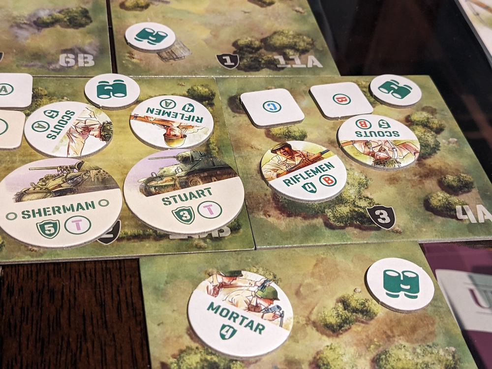
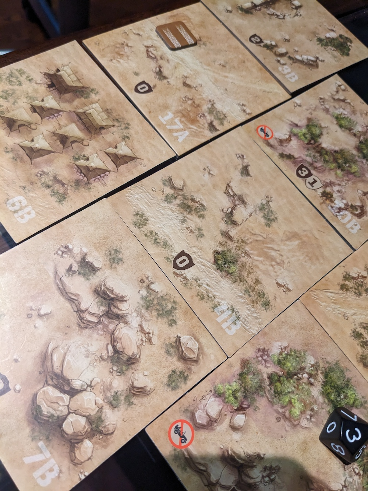
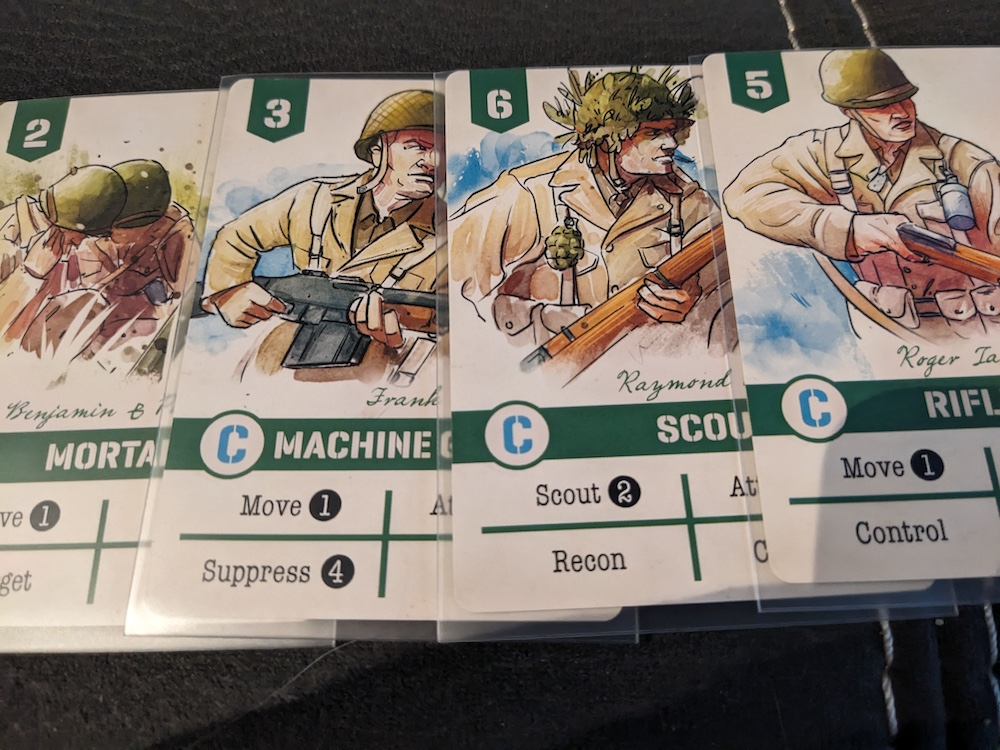
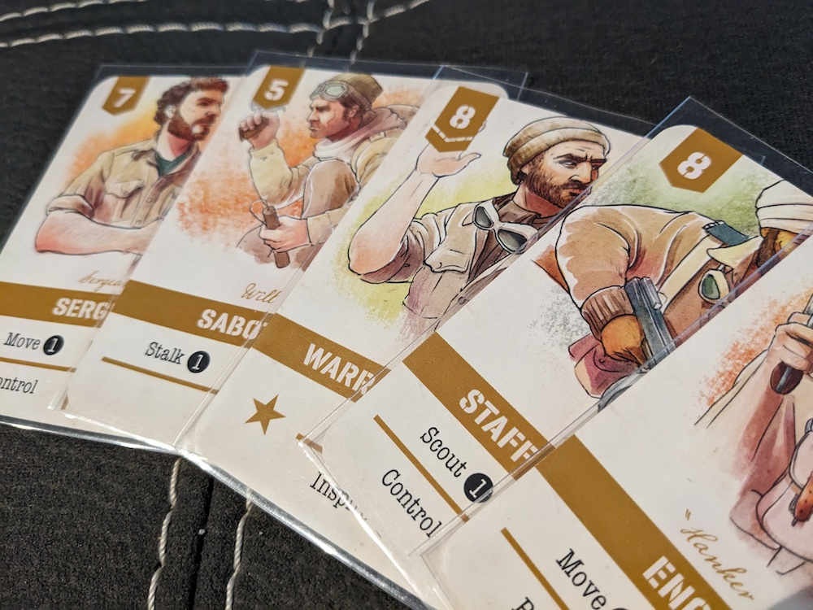
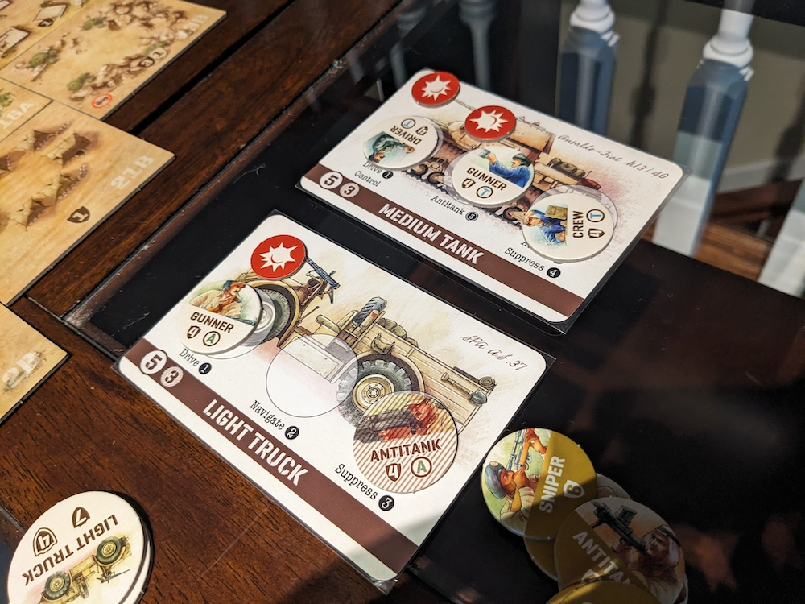

[MeepleIt Profile: Undaunted Normandy](https://meepleit.com/boardgame/268864/undaunted-normandy)

[MeepleIt Profile: Undaunted North Africa](https://meepleit.com/boardgame/290359/undaunted-north-africa)

If you’re stepping into the world of Undaunted, you’re in for a treat, but the choice between Normandy and North Africa might have you at a crossroads. Both games offer unique experiences, each capturing the intensity of World War II through different lenses.

David Thompson and Trevor Benjamin first crafted Undaunted: Normandy, which later evolved into Undaunted: North Africa as the second part of the series. However, these aren’t expansions and cannot be played together in the same way as the Imperium series (Horizons/Legends/Classics).

Instead, Undaunted series are a standalone games, including other titles int he trilogy like Stalingrad and Battle of Britain. We'll be touching only Normandy and North Africa, but it’s worth noting that the Reinforcements expansion exists, which will help guide your decision on which one to purchase.

## Thematic War

The theme in both of these games are expectional representation of World War theme.

In Normandy your in the year 1944 and the Allies have landed in Normandy. You must lead your US army forward as you push deeper into France and gain foothold drive back the German forces.

The game captures the gritty and tactical nature of small unit engagements during this critical phase of the war. Players take on the roles of either American or German commanders, leading squads of soldiers across various battlefields in Normandy. The scenarios are inspired by historical events, and the game emphasizes the importance of maneuvering troops, controlling key objectives.

In North Africa, the historical event happens in the summer of 1940 as the Long Range Dessert Group (LRDG) a reconnaissance and convert operations unit of the British Army have just been formed as they face against the Royal Italian Army's formidable forces. Nevre knew and interestinng to see that Italians actually fought in North Africa

Similarly, the map tiles depicting the North African desert are designed to reflect the vast, sun-scorched expanses that characterize this arid region. The tiles showcase the shifting sands, rocky outcrops, and sparse vegetation typical of the desert landscape. The color palette incorporates a range of warm, earthy tones, and the textures suggest the heat and dryness of the environment. This creates an experience that transports players to the harsh, yet captivating, beauty of the North African theater of war.

## Specialized Units

In Normandy, both the U.S. Army and the Germans field similar units, such as Scouts, Machine Gunners, Snipers, Mortar teams, Riflemen, Platoon Sergeants, Platoon Guides, and Squad Leaders. Each side may have multiple groups of certain units, like Scouts or Riflemen, labeled as Scout A, Scout B, and Scout C, for instance.

In Undaunted: North Africa, the units contain different units for both the Long Range Desert Group (LRDG) and the Italians. The Italians introduce Tank Crews, as vehicles are present in this version. For instance, a Tank Crew member has the ability to repair, and the Anti-Tank Rifleman who can attack and damage vehicles. Additionally, the Italians have a Recon Aircraft that can fly in and directly attack enemies from the air.

The LRDG units include Saboteur, Engineer, and Sergeant, all of whom can demolish structures. The Staff Sergeant combines the abilities of a Scout and Rifleman, capable of scouting, controlling, and recon during actions. However, the LRDG lacks Riflemen, as their strategy focuses on demolishing structures rather than direct combat. The LRDG also includes a Lieutenant who has a bolster action similar to that of the Platoon Sergeant.

## The Mechanics

The strong feature of the Undaunted series is the deck building mechanics. This is the core system of the series which is played throughout all the Undaunted games. Can't say much more as they both play the same and one of the main reasons why I love playing this game.

Vehicles are one of the major mechanics introduced in North Africa that set it apart from Normandy. While they add new strategic options in certain scenarios, they are not overpowered. With the right actions, opponents can attack or disable a vehicle after dealing enough damage. Vehicles can easily transport 3 units to a destination but provides some abilities like navigating, supressing or attacking.

Vehicles can be attacked and damaged by the Anti-tank rifleman unit. When a vehicle is hit, one of the units inside also receives a hit. Thus, being in a vehicle is risky, as it not only exposes the vehicle to damage but also puts the units inside at risk of being hit.

## Game Play

The key gameplay difference in North Africa is the handling of casualties, which adds to the game's challenge. When a unit takes a hit, its card is removed, similar to the Normandy campaign. However, unlike in Normandy, the unit does not respawn, even if its card remains in the supply decks. The unit is considered permanently lost, and its combat token is entirely removed from the game.

Strategies need to be carefully planned, as it's crucial to avoid having your key units take too many hits, particularly those vital for controlling or demolishing objectives. If these units are lost, your forces will be neutralized, significantly increasing the risk of losing the game.

North Africa’s gameplay features fewer units on the map, demanding more tactical planning before attacking. With fewer objectives to claim, each move carries greater weight.

In contrast, Normandy provides more units both on the map and in the player’s supply. As mentioned earlier, units in groups A, B, and C can respawn and require more hits to completely remove a combat token. Both sides typically have their units arranged in a balanced setup, facing off against each other. In some scenarios, the action escalates into a rapid exchange of attacks, with dice rolls fueling the intense back-and-forth between the forces.

Another point regarding the units in North Africa is that the game features asymmetrical gameplay, requiring distinct strategies and approaches to defeat your opponent.

For example, in one scenario where I played as the Italian army, our units were on foot, while the LRDG advanced comfortably in their vehicles. Fortunately, the Italians had an Anti-tank rifleman, a crucial unit with the ability to attack and damage vehicles. Keeping this key unit alive is essential to achieving the objective.

## Objective Goals in Scenarios

The objectives in North Africa arre more engaging and challenging. For instance, the LRDG missions require you to either escape with a certain number of units or demolish structures to achieve your goals. To tackle these objectives efficiently, it’s crucial to use vehicles to cover ground quickly. Just remember, while speeding across the terrain, avoid taking hits!

In Normandy, certain objectives are located just one or two tiles away from the starting point. By deploying a Scout and then using a Rifleman to control the area, you can secure your first objective without engaging in combat. However, as the game advances, it becomes more challenging to reach the remaining objectives, especially as units begin to clash more frequently.

Both of these games offer variety of content, featuring 12 distinct scenarios for Normandy and 11 for North Africa. Each scenario is designed to present unique challenges and tactical situations, ensuring that you face diverse combat scenarios and strategic dilemmas. Whether you’re navigating the lush fields of Normandy or the vast deserts of North Africa, the numerous scenarios will keep you engaged and constantly adapting to new battlefield conditions.

## Verdict

Overall they are both great games that play the same way. As you can see there are differences but you will still get the same combat excitement and experience. Once you learn one the other will be easy to learn and get into.

I’d recommend starting with Normandy, as it’s easier to learn without the added complexity of vehicle mechanics. However, if you're up for a bit more of a challenge, North Africa is also a great place to begin—there's no set order to follow, so either choice is fine depending on your preference!

Once you become a fan of the Undaunted series, you'll want to check out the Reinforcements expansion, which adds even more content and scenarios for both Normandy and North Africa in a single box. Not only does it enrich the gameplay, but it also introduces a full solo mode (which I will write about), allowing you to enjoy both games on your own.

Stay tuned for more insights, including a detailed look at the Reinforcements expansion, which enhances both games and adds a solo mode.
