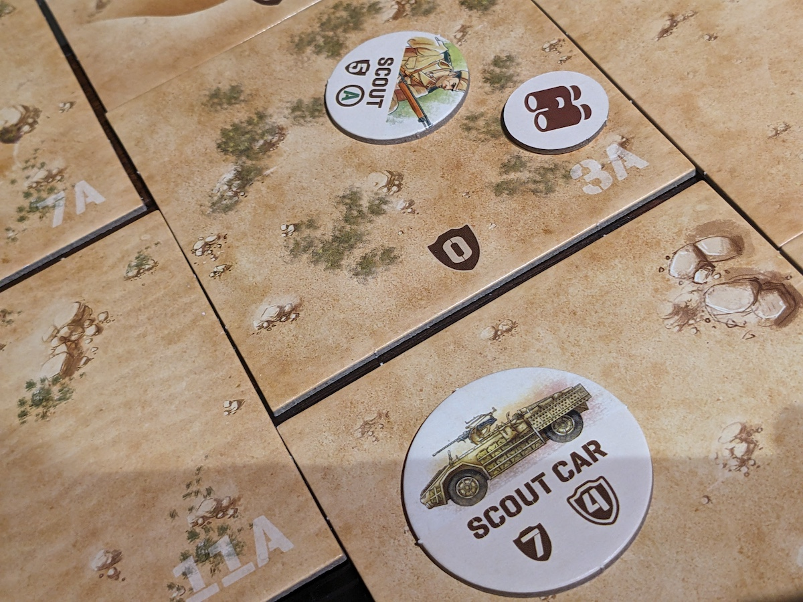
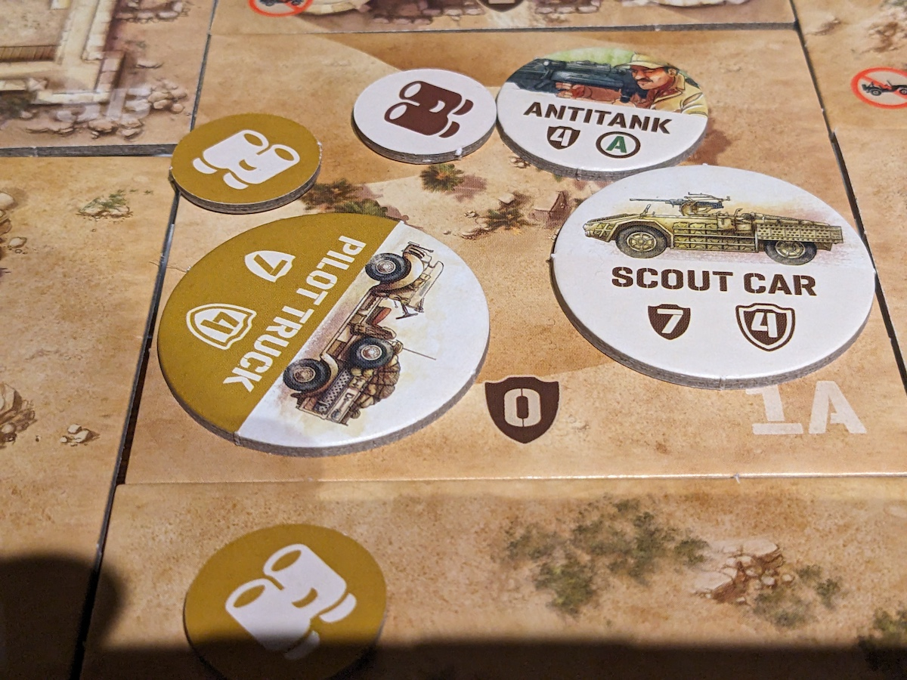
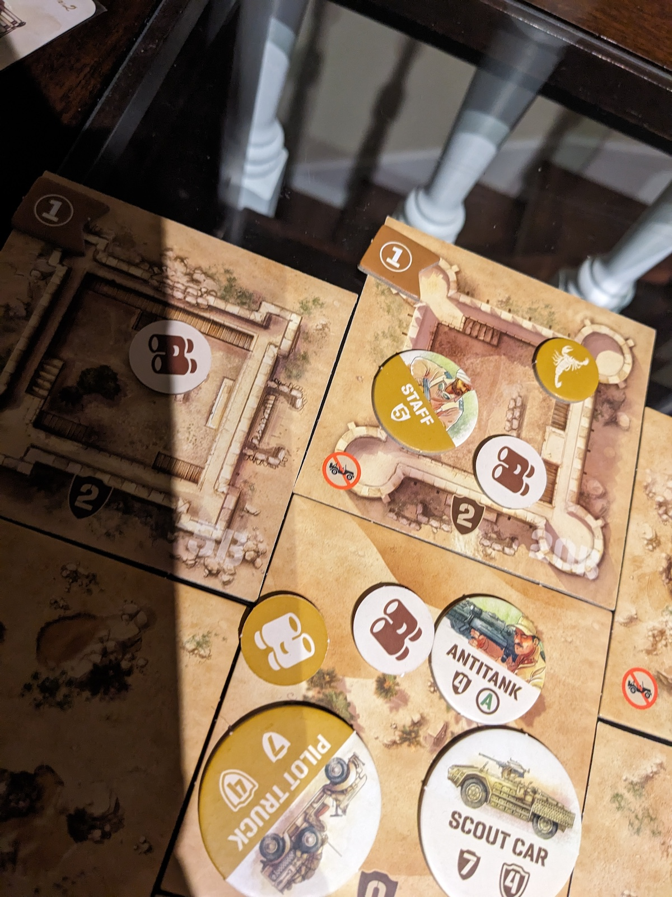

It's January 11, 1941, the Italians land in South-westen Libya to capture the airfield as the LRDG's objective is to prevent the Italian from garrison the airfield in Undaunted North Africa.

I played the Italians in Scenario 3 in Undaunted North Africa, as we needed to neutralize the LRDG Sergeant and Staff Sergeant and the LRDG troop need too claim 1 objective point.

Scenario 3 is not a complex or tough as there are a limited number of units that are set in the game setup but introduces vehicles as combat which will be bit harder and more tatical strategies involved. The LRDG units will be on the offensive side as they will come storming in to claim their objective point.

The LRDG have an advantage at the start of the game as they are already placed in vehicles with with more troops. The Italians are on foot and must rush to the abandoned Scout car. However, some Italian units need to stay back and defend the objective point, as the LRDG could charge in with their vehicles at any moment.

I immediately dispatched the Scout to begin reconnaissance and head towards the unoccupied Scout car. My plan was to quickly pick up units that can bolster our combat strength. Vehicles offer a significant advantage by enabling faster and safer troop transport, but we must remain vigilant as the LRDG anti-tank units pose a constant threat.

The LRDG troops begin driving in and at the same time their snipers shooting from long range distances. I did move my anitank gunner to get closer to the enemies which wasn't smart but the sniper sniping me causing a causilty. Their troops grew stronger by bolstering. Sametime they were navigating, which means they are able to scout from the vehicle then eventually drive through the lands.

My Scout got the desserted vehicle and began driving back to help out the other troops as danger was starting to form around the objective points. My Scout arrived close to the enimey vehicle but they were too strong as they were attacking my Antitank Gunner and my Scout. I should have avoided the enemies and kept more distance from them. Regardless, they had overwhelming firepower. I inflicted some casualties, but it wasn't enough. Unfortunately, I also rolled poorly and didn't have much luck on my side.

The LRDG sergeant disembarked from the vehicle, using two combat card actions—one to move into the objective area and another to secure control. This led to the Italians surrendering, giving the LRDG the victory in the war.

Overall I did not play this well. Wasted too much time having the Scout running after the the scout car. At the end of the day the scout car wasn't to effective. I should have build up my units by bolstering and wait for the enemies to approach and defend the objective points. Instead I had them scattered around trying to attack them from different angles which did not work so well. I also didn't have luck with the dice numbers and we missed our target quite a few times.

Another strategy I should have performed was surpressing the enemies which slows the opponent down. Basically when successful, the combat token gets flipped on the other side. Then opponent requires an action to flip it back for combat. The chances are higher to suppress than to attack as it requires 4 dice to roll.

The vehicle mechanics in the scenario plays well. I like the fact how effective the vehicles are and how they can come storming into the objectives. At the same time, to attack the vehicles only certain troops like Antitank Rifleman can cause damage to a vehicle and which then causes a casuality to one of the troops inside the vehicle.

Scenario 3 features a small map with minimal complexity, yet it offers some intriguing strategies. It's the first scenario to introduce vehicles, making it an excellent starting point for learning about vehicle mechanics. The game length can be between 30 and 45 minutes of course depends how lucky 

