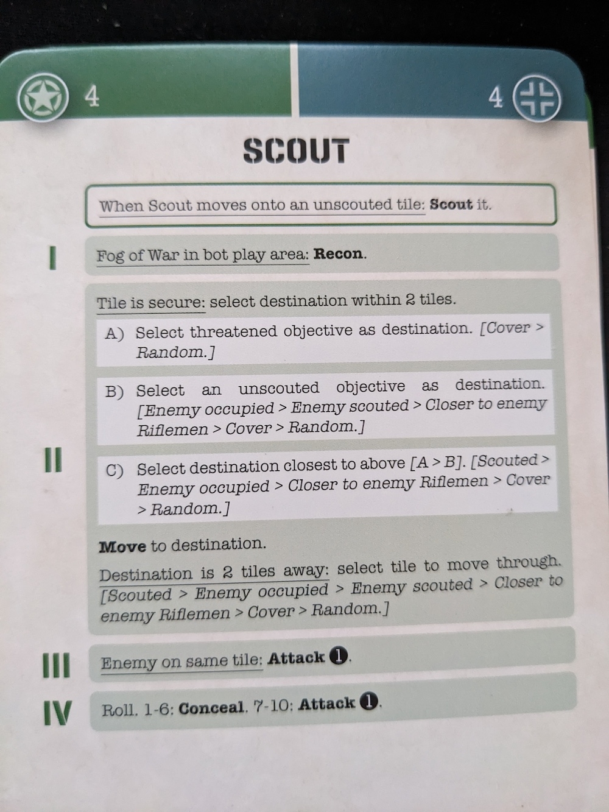

<!-- > Name: Life of the Amazonia (2023)
> Designer: Jamie Bloom
> Publisher: Bad Comet Games -->

I previous wrote a blog on [Which Should I Buy: Normandy vs North Africa](https://blog.meepleit.com/posts/undaunted/normandy-vs-north-africa/). I gave a summary of the differences between the two games, emphasizing that this expansion brings even more captivating content to each of them.

Undaunted: Reinforcements adds new scenarios, units, and, most notably, a solo mode to both Normandy and North Africa. It also includes components for four-player team battles, enhancing the series' tactical depth and variety.

The solo mode is the grand prize in this expanison, designed by David Digby and Dávid Turczi, allows fans of war-themed games to enjoy the experience when not having others to play with, making it a great option for solo play.

## Overview of Reinforcements

The expansion introduces a range of new rules, scenarios, and units. You will take on either the Germans or Americans, as tanks are introduced in Undaunted: Normandy, or make use of the mines, assault aircraft, and other new units as you attempt to beat your opponent in Undaunted: North Africa.

An additional 4 new scenaios for each Normandy and North Africa are introduced allowing you to play with the new components and mechanics for example:

- Mines
- Two new specialist: US Grenadiers and German Submachine Gunners.
- New vehicles For Normandy.

## Solo Mode Mechanics

 --- show stack of solo cards

Each army unit comes with its own AI deck of cards tailored to each scenario. For instance, a Rifleman will have varying conditions and behave differently depending on the scenario.

For setup, you'll need to choose a specific number of AI bot cards according to the scenario. For example, when playing against the Germans, you'll select all German AI bot cards numbered for that scenario. Some of these cards may be used in multiple scenarios.

During gameplay, if the AI bot takes initiative, it will draw four cards in the order indicated by the numbers at the top. For each card played, you must select the corresponding AI bot card and follow a flowchart of conditions. Each unit is treated as if it were controlled by a human player.

Quick example of a rundown Scout unit for the US Army or German for scenario 4:

The card outlines four conditions. First, you need to point out where the enemy unit is located on the tiles then read each condition and verify of the situation is true and then perform action.

- "Fog of War." If this condition is met, carry out the corresponding Recon action.

- "Tile is secure," which also contains additional subconditions. This will make the Scout move 2 tiles closer to the objective or directly on it.

- Enemy on same tile: Attack. If a enemy is on the same title, the Scount will attack your unit.

- Roll dice: Depending on the roll dice value bot will conceal or perform an attack

While keeping in mind, that the Scout is meant to explore unscouted areas within a 2-tile range, towards the unclaimed objective.

## Difficulty and Replayability

he AI bot adapts to each scenario, providing a suitably challenging experience. After losing to the AI, I was eager to replay the scenaro with a different strategy to see if I could turn the tide.

The way the AI bot flows units will go directly afterr the objectives. If they're far from their objectives they'll come runnning through the fields or driving through the dessert to get to the objectives.

They can inspire specific units, allowing them to perform multiple actions. In one instance, the Squad Leader inspired their Rifleman to move toward an objective and then claim it. I also encountered Machine Gunners who were inspired to attack the same unit twice, knocking my combat token off the map.

Overall, the AI can be more challenging than a human opponent, as the card’s conditions often align with what the units need to accomplish. It tends to take more risks than a human player might. Ultimately, you're still rolling the dice for the AI, just as you would if your opponent were rolling them.

## Pros

- **Well-Integrated AI System**: The AI bot is thematically designed to reflect how human players might play, using cards and flowcharts to determine its moves. The structure allows for thoughtful decision-making, where the AI’s actions often align with its units' goals.

- **Challenging AI:**: Evenn without having a player to play with, AI bot allows a clear and well-designed flowchart, creating strategic and challenging opponents. The AI can often take calculated risks that mimic human-like decisions, making each game feel engaging.

## Cons

- **Learning curve**: you will need to learn some of the keywords which are mentioned with the conditions. The AI's turns can feel a bit mechanical at times, and it may slow down the flow of the game compared to a real-time human opponent.

- **AI Decision-Making Limitations**: Situations may arise where you’re unsure how to resolve them or understand why they happen. In North Africa, scenario 5, the Machine Gunner and vehicle started on the same tile and remained there throughout the entire game. The AI bot card provided no instructions for the unit to enter the vehicle or move. The Machine Gunner couldn’t attack or suppress because my units were too far away and spread out.

- **Mentally exhausting and lengthy games**: Keeping track of both the player's and AI’s units, following its flowchart decisions, and managing conditions can add to the length of the game, especially in more complex scenarios.

## Verdict

Reinforcements provides a detailed and challenging solo mode that allows you to enjoy the Undaunted games even when you don't have an opponent to play with. While it can feel a bit wonky at times, it still offers plenty of enjoyment and requires strategic thinking to win.

Without the solo mode, I don’t think I would have ever touched the Undaunted series. If you're a fan of the series and want to get it on the table more often, this expansion is a worthwhile investment. In addition to the solo mode, it also adds more scenarios and units, giving you even more opportunities to explore and fight your way to victory.
